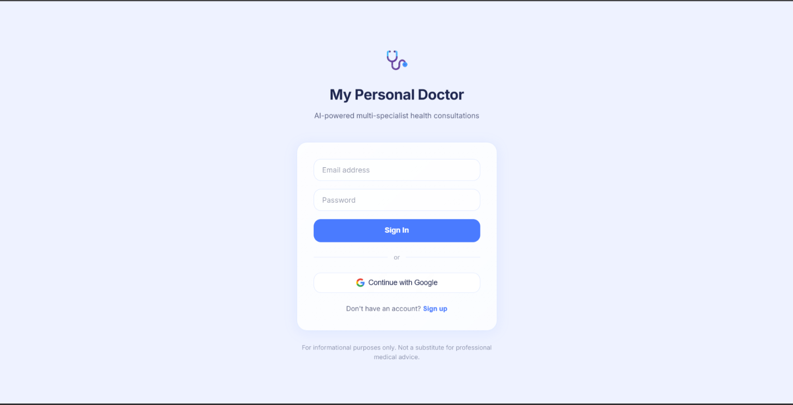
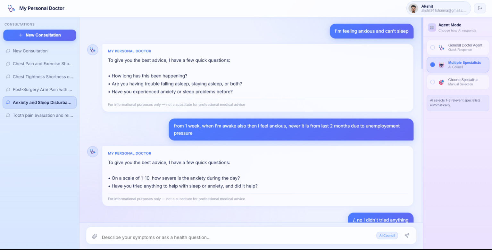
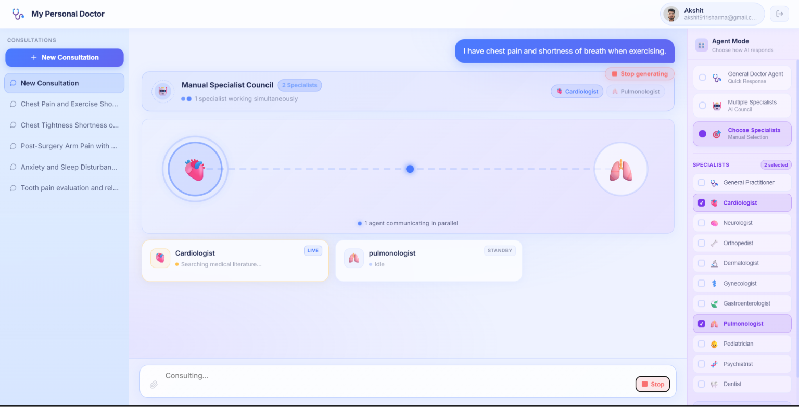
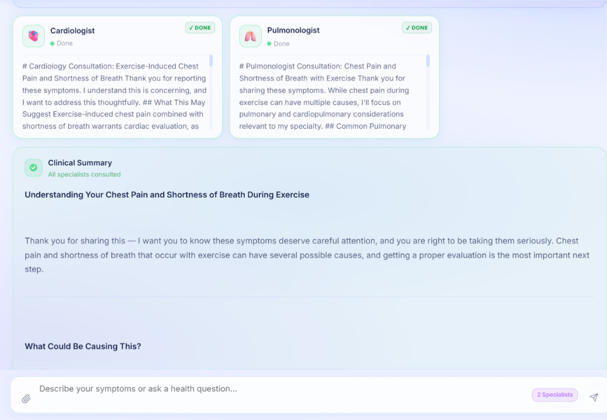
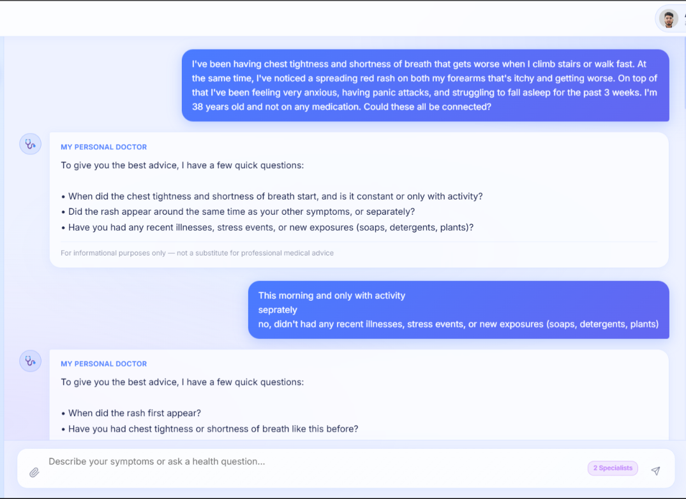
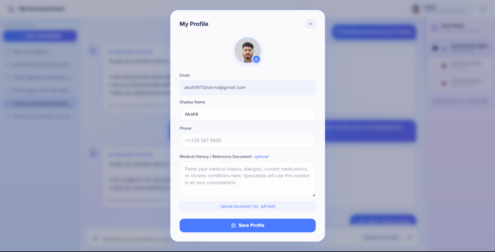

<div align="center">



# 🩺 My Personal Doctor

### AI-Powered Multi-Specialist Health Consultation Platform

**Describe your symptoms. Our AI council of specialists consults in real time — together — to give you a comprehensive, patient-friendly answer.**

[](https://fastapi.tiangolo.com/)
[](https://react.dev/)
[-8A2BE2?style=flat-square)](https://anthropic.com/)
[](https://langchain-ai.github.io/langgraph/)
[](https://supabase.com/)
[](https://www.trychroma.com/)

</div>

---

## Table of Contents

- [What Is This?](#-what-is-this)
- [Key Features](#-key-features)
- [How It Works](#-how-it-works)
- [App Screenshots](#-app-screenshots)
- [Tech Stack](#-tech-stack)
- [Specialist Agents](#-specialist-agents)
- [Project Structure](#-project-structure)
- [Getting Started](#-getting-started)
- [Environment Variables](#-environment-variables)
- [RAG Data Ingestion](#-rag-data-ingestion)
- [Docker Deployment](#-docker-deployment)
- [Architecture Deep Dive](#-architecture-deep-dive)
- [Disclaimer](#-disclaimer)

---

## What Is This?

**My Personal Doctor** is a full-stack AI health consultation platform. When you describe your symptoms, a fast triage agent (Claude Haiku) reads your query and automatically selects the most relevant medical specialists. Those specialists then run **in parallel** — each searching curated medical literature via RAG (Retrieval-Augmented Generation) — and their individual findings are synthesized by a senior Claude Sonnet agent into one clear, empathetic, patient-friendly response.

Think of it as having a **panel of AI doctors consult on your case in real time**, right in your browser.

> **For informational purposes only. Not a substitute for professional medical advice.**

---

## Key Features

| Feature | Description |
|---|---|
| **AI Triage** | Claude Haiku instantly classifies your query and picks the right specialists |
| **Parallel Multi-Agent** | Up to 3 specialists work simultaneously via LangGraph parallel dispatch |
| **RAG-Powered** | Every specialist searches domain-specific medical literature (NIH, NHLBI, AAP, etc.) |
| **Live Streaming** | Watch each specialist think and respond in real time via WebSocket |
| **3 Agent Modes** | General Doctor (quick), AI Council (auto-select), Choose Specialists (manual) |
| **PDF Upload** | Attach lab reports or medical documents — extracted text is injected into the consultation |
| **Chat History** | All consultations are persisted and resumable |
| **User Profile** | Save your medical history/allergies so all specialists have context |
| **Secure Auth** | Email/password + Google OAuth via Supabase |

---

## How It Works

```
Your Message
     │
     ▼
┌─────────────────────────────┐
│   Triage Agent (Haiku)      │  → Classifies symptoms
│   Fast, cheap, accurate     │  → Selects 1–3 specialists
└─────────────┬───────────────┘
              │  parallel dispatch (LangGraph Send API)
    ┌─────────┼──────────┐
    ▼         ▼          ▼
┌────────┐ ┌────────┐ ┌──────────┐
│Cardio- │ │Neurol- │ │Psychia-  │  Each agent:
│logist  │ │ogist   │ │trist     │  1. Searches ChromaDB (k=3 chunks)
│(Haiku) │ │(Haiku) │ │(Haiku)   │  2. Reads medical literature
└────┬───┘ └───┬────┘ └────┬─────┘  3. Streams thinking live
     └─────────┴───────────┘
                 │
                 ▼
    ┌─────────────────────────┐
    │  Synthesis Agent        │  → Reads all specialist outputs
    │  (Claude Sonnet)        │  → Produces final patient-friendly answer
    └─────────────────────────┘
                 │
                 ▼
          Your Browser (WebSocket stream)
```

**WebSocket Event Flow:**
```
triage_start → triage_complete → [agent_start → agent_thinking → agent_token... → agent_complete] (parallel) → synthesis_start → synthesis_token... → synthesis_complete
```

---

## 📸 App Screenshots

### Login Page
Clean, minimal auth screen with email/password or Google OAuth.


---

### Main Interface
The home screen greets you with suggested symptom prompts and shows your available specialist roster.


---

### Chat Interface — Conversational Flow
The AI doctor follows up with targeted questions to understand your symptoms better before routing to specialists.



---

### Multi-Agent Animation — Specialists Working in Parallel
Watch a live animation as multiple specialists search medical literature simultaneously. Each agent card shows its real-time status: **LIVE**, **STANDBY**, or **DONE**.



---

### Multi-Agent Conversation — Results Side by Side
Specialist consultation cards appear side by side. When a specialist finishes, it shows ✓ DONE. You can read each specialist's reasoning independently.


---

### Clinical Summary — Synthesized Answer
After all specialists finish, a unified **Clinical Summary** is generated by Claude Sonnet, weaving all specialist insights into one clear answer.



---

### Follow-Up Conversation
The system maintains full conversation context, so you can answer follow-up questions and the specialists refine their advice accordingly.



---

### Agent Mode Selection
Three modes to choose how AI responds — General Doctor for quick answers, AI Council for auto-selected specialists, or manual specialist selection.


---

### Consultation History
All past consultations are saved in the sidebar, organized by topic, and resumable at any time.


---

### My Profile
Set your display name, phone, and optionally paste your medical history or upload documents — this context is automatically injected into every consultation.



---

## 🛠️ Tech Stack

| Layer | Technology | Purpose |
|---|---|---|
| **LLM** | Anthropic Claude API | Haiku (triage + specialists) · Sonnet (synthesis) |
| **Agent Orchestration** | LangGraph `StateGraph` | Parallel multi-agent workflow with automatic join |
| **Vector DB** | ChromaDB (embedded) | Stores & retrieves medical literature chunks |
| **Embeddings** | `all-MiniLM-L6-v2` | Local, free sentence embeddings (no API cost) |
| **Backend** | FastAPI + uvicorn | REST API + WebSocket server |
| **Frontend** | React 18 + Vite + TypeScript | UI with Zustand state management |
| **Auth & DB** | Supabase | Authentication, chat history, user profiles |
| **PDF Processing** | PyMuPDF + pytesseract | Extracts text from uploaded medical documents |

---

## 👨‍⚕️ Specialist Agents

The platform includes **11 specialist AI doctors**, each backed by domain-specific medical literature:

| Specialist | Domain | ChromaDB Collection |
|---|---|---|
| 🩺 General Practitioner | Primary care, general health | `gp_general` |
| ❤️ Cardiologist | Heart & cardiovascular system | `cardiology` |
| 🧠 Neurologist | Brain, nerves & nervous system | `neurology` |
| 🦴 Orthopedist | Bones, joints & muscles | `orthopedics` |
| 🌸 Gynecologist | Women's reproductive health | `gynecology` |
| 🔬 Dermatologist | Skin conditions & diseases | `dermatology` |
| 🫁 Pulmonologist | Lungs & respiratory system | `pulmonology` |
| 🥗 Gastroenterologist | Digestive system & gut health | `gastroenterology` |
| 👶 Pediatrician | Children's health | `pediatrics` |
| 🧩 Psychiatrist | Mental health & behavior | `psychiatry` |
| 🦷 Dentist | Oral & dental health | `dentistry` |

---

## 📁 Project Structure

```
personal-doctor/
├── backend/
│   ├── agents/
│   │   ├── base_agent.py          # Base class for all specialist agents
│   │   ├── registry.py            # Maps specialist keys to agent classes
│   │   └── specialists/           # 11 specialist agent implementations
│   ├── api/
│   │   └── routes/                # REST endpoints (auth, chats, messages, health)
│   ├── graph/
│   │   └── builder.py             # LangGraph StateGraph — compiled once at startup
│   ├── rag/
│   │   ├── chroma_client.py       # Singleton ChromaDB client
│   │   ├── embedder.py            # Singleton sentence-transformer model
│   │   └── retriever.py           # k=3 RAG retrieval per specialist
│   ├── services/
│   │   └── supabase_client.py     # Supabase client (service role)
│   └── utils/
│       └── history.py             # Sliding window (last 10 messages)
├── frontend/
│   └── src/
│       ├── api/                   # API clients (auth, chats, documents)
│       └── components/
│           ├── chat/              # Chat UI, PDF upload button
│           └── ui/                # GlassCard, GlassButton, TypewriterText, etc.
├── scripts/
│   ├── download_sources.py        # Downloads free NIH/medical data
│   ├── ingest_all.py              # Chunks & embeds all RAG data into ChromaDB
│   └── verify_collections.py     # Confirms ChromaDB collections are populated
├── supabase/
│   └── schema.sql                 # Database schema (run in Supabase SQL editor)
├── rag_data/                      # Raw medical text files by specialty
├── chroma_db/                     # Persisted ChromaDB vector store
├── .env.example                   # Environment variable template
└── docker-compose.yml             # One-command Docker deployment
```

---

## Getting Started

### Prerequisites

- **Python 3.11+**
- **Node.js 18+**
- **Tesseract OCR** (for PDF text extraction)
  ```bash
  # Windows
  choco install tesseract

  # Ubuntu/Debian
  apt install tesseract-ocr
  ```
- A **Supabase** project (free tier works)
- An **Anthropic API key**

---

### 1. Clone & Configure

```bash
git clone <your-repo-url>
cd personal-doctor

# Copy and fill in environment variables
cp .env.example backend/.env
```

Edit `backend/.env` with your credentials (see [Environment Variables](#-environment-variables) below).

---

### 2. Supabase Database Setup

Open your Supabase project → **SQL Editor** → paste and run the contents of `supabase/schema.sql`.

This creates the tables: `profiles`, `chats`, `messages`, `uploaded_documents` — all with Row Level Security enabled.

---

### 3. Backend Setup

```bash
cd backend
pip install -r requirements.txt
```

---

### 4. Ingest RAG Data (one-time)

```bash
# From project root — downloads free NIH medical literature
python scripts/download_sources.py

# Chunks, embeds, and stores in ChromaDB
python scripts/ingest_all.py

# Verify collections were populated
python scripts/verify_collections.py
```

> This only needs to be run once, unless you add new medical sources.

---

### 5. Start the Backend

```bash
cd backend
uvicorn main:app --reload --port 8000
```

Backend will be available at `http://localhost:8000`.

---

### 6. Start the Frontend

```bash
cd frontend
npm install
npm run dev
```

Frontend will be available at `http://localhost:5173`.

---

## 🔑 Environment Variables

Create `backend/.env` from `.env.example`:

```env
# Anthropic — get from console.anthropic.com
ANTHROPIC_API_KEY=your_anthropic_api_key_here

# Supabase — get from your project Settings → API
SUPABASE_URL=https://your-project.supabase.co
SUPABASE_ANON_KEY=your_supabase_anon_key
SUPABASE_SERVICE_ROLE_KEY=your_supabase_service_role_key
SUPABASE_JWT_SECRET=your_supabase_jwt_secret

# ChromaDB storage path (relative to backend/)
CHROMA_DB_PATH=../chroma_db

# CORS — your frontend origin
FRONTEND_URL=http://localhost:5173

ENVIRONMENT=development
```

| Variable | Where to find it |
|---|---|
| `ANTHROPIC_API_KEY` | [console.anthropic.com](https://console.anthropic.com) → API Keys |
| `SUPABASE_URL` | Supabase Dashboard → Settings → API → Project URL |
| `SUPABASE_ANON_KEY` | Supabase Dashboard → Settings → API → `anon` key |
| `SUPABASE_SERVICE_ROLE_KEY` | Supabase Dashboard → Settings → API → `service_role` key |
| `SUPABASE_JWT_SECRET` | Supabase Dashboard → Settings → API → JWT Secret |

> **Never expose `SUPABASE_SERVICE_ROLE_KEY` to the frontend.** It bypasses Row Level Security.

---

## RAG Data Ingestion

The RAG pipeline powers every specialist's medical knowledge:

```
Free Public Sources  →  rag_data/{specialty}/  →  ChromaDB
(NIH, NHLBI, AAP…)       .txt files              vector embeddings
```

**Data sources used:**
- NIH MedlinePlus XML
- NHLBI (heart & lung)
- NINDS (neurological)
- NIDDK (digestive & kidney)
- NIAMS (bones & muscles)
- NIMH (mental health)
- womenshealth.gov (gynecology)
- DermNet NZ (dermatology)
- AAP HealthyChildren.org (pediatrics)
- Wikipedia medical articles

**Adding your own data:**
1. Place `.txt` files in `rag_data/{specialty}/`
2. Re-run `python scripts/ingest_all.py`
3. Verify with `python scripts/verify_collections.py`

**RAG settings:**
- Chunk size: ~2000 characters (~512 tokens)
- Retrieval: k=3 chunks per query
- Embeddings: `all-MiniLM-L6-v2` (runs locally, no API cost)

---

## 🐳 Docker Deployment

Deploy the full stack with a single command:

```bash
# Build and start both services
docker-compose up --build

# Backend → http://localhost:8000
# Frontend → http://localhost:3000
```

The `docker-compose.yml` mounts `chroma_db/` and `rag_data/` as volumes so your ingested data persists across container restarts.

---

## Architecture Deep Dive

### Singleton Pattern
Three objects are created **once at startup** and reused across all requests:

| Singleton | File | Why |
|---|---|---|
| `COMPILED_GRAPH` | `graph/builder.py` | LangGraph compilation is expensive |
| ChromaDB client | `rag/chroma_client.py` | One persistent embedded DB connection |
| Sentence-transformer | `rag/embedder.py` | `all-MiniLM-L6-v2` takes ~2s to load |

### Token Efficiency

| Agent | Model | Max Output Tokens |
|---|---|---|
| Triage | `claude-haiku-4-5` | 200 |
| Each specialist | `claude-haiku-4-5` | 800 |
| Synthesis | `claude-sonnet-4-6` | 1200 (called once per query) |

- **Sliding window:** Only the last 10 messages are sent (enforced in `utils/history.py`)
- **Prompt caching:** All static system prompts use `cache_control: {"type": "ephemeral"}` to reduce repeated token costs

### WebSocket Authentication
Browser WebSockets cannot send custom headers during the handshake. Solution: the JWT token is sent as the **first message payload** after the connection opens:

```json
{"type": "message", "content": "...", "token": "<JWT>"}
```

The backend verifies the token on every message via `verify_ws_token()` in `api/dependencies.py`.

### LangGraph Parallel Dispatch
The `route_to_specialists()` function in `graph/edges.py` returns a `List[Send]` — LangGraph executes all specialist nodes in parallel. The `specialist_responses` field uses an `operator.add` reducer to safely accumulate responses from all parallel nodes. The `synthesis_node` automatically waits for all specialists before running — no manual locks or counters needed.

### Document Upload vs RAG
| Uploaded PDFs | RAG Collections |
|---|---|
| Injected directly into the user turn | Stored in ChromaDB |
| Per-user, per-session context | Curated public medical literature |
| Not indexed in ChromaDB | Reusable across all users |
| Prepended as `"Patient records:\n{doc_ctx}\n\nQuery: ..."` | Retrieved at k=3 per query |

---

##  Disclaimer

**My Personal Doctor is for informational and educational purposes only.**

- It is **not** a licensed medical device or service
- It is **not** a substitute for professional medical advice, diagnosis, or treatment
- Always consult a qualified healthcare provider for medical decisions
- In case of emergency, call your local emergency services immediately

---

<div align="center">

Built with ❤️ using Claude API · FastAPI · React · LangGraph · ChromaDB · Supabase

</div>
